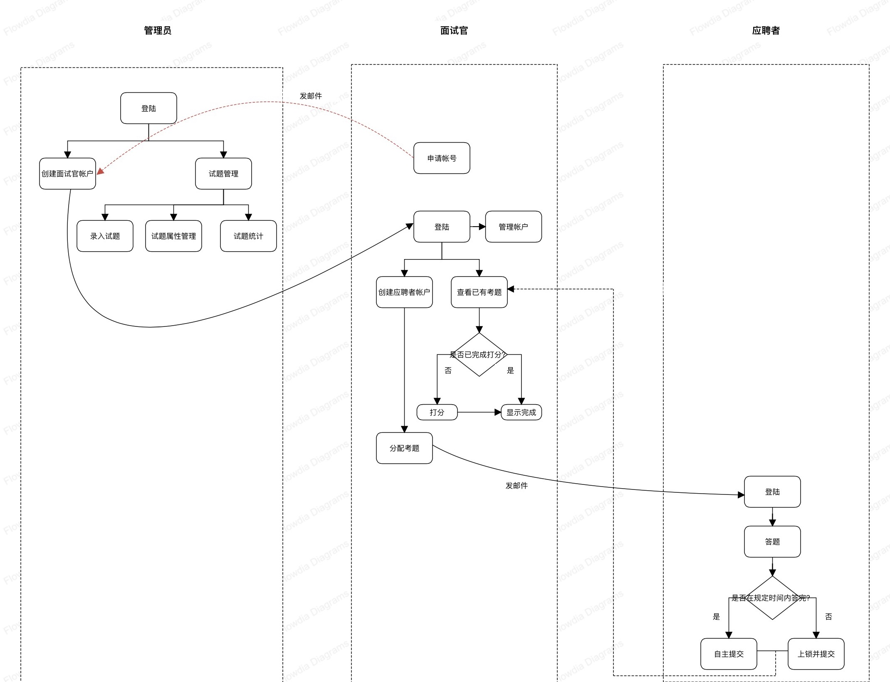
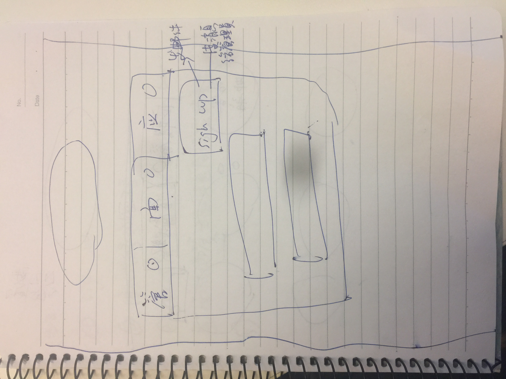
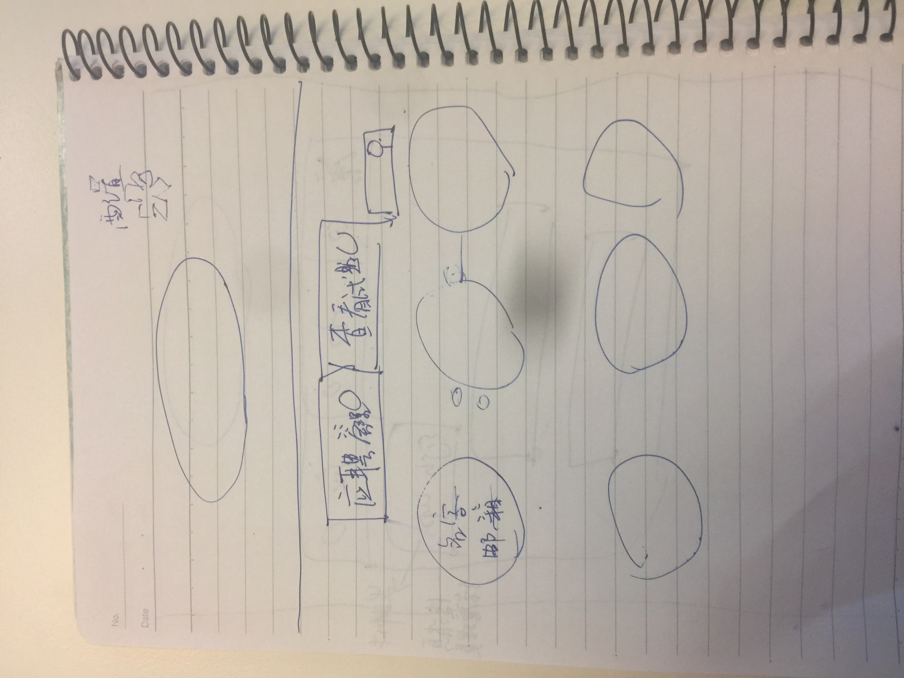
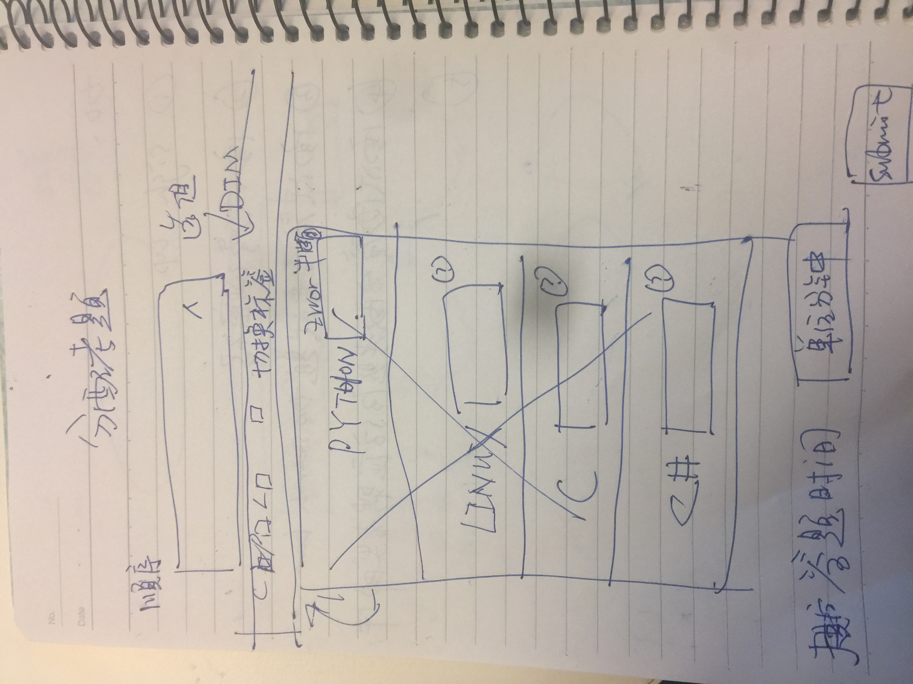
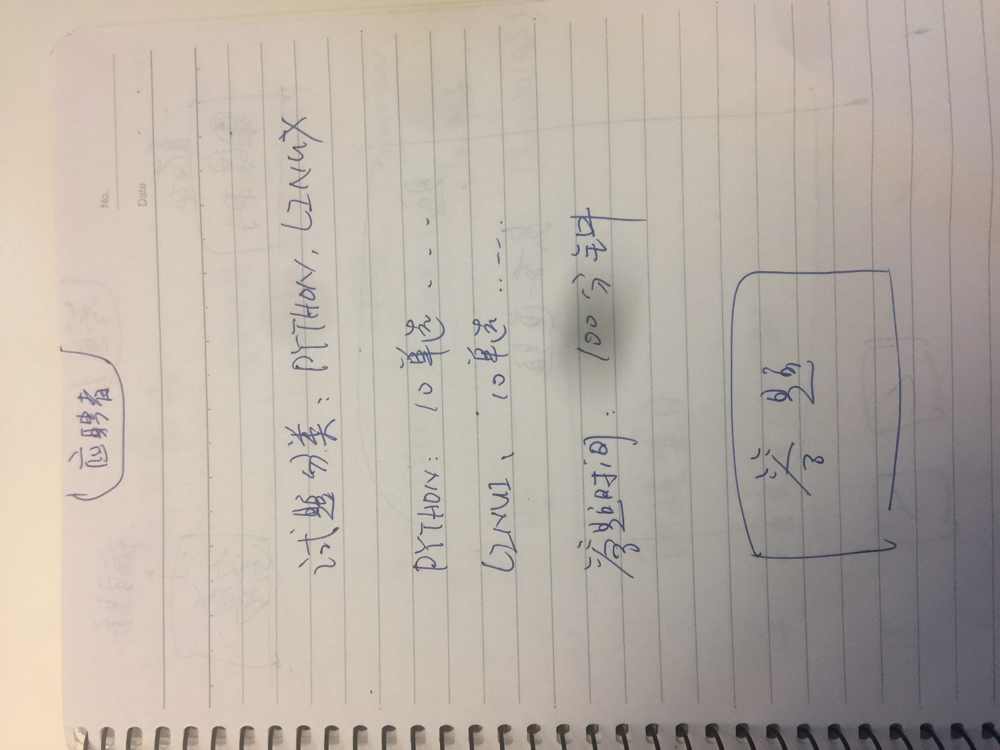
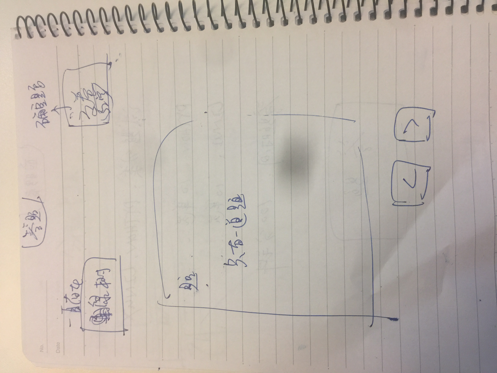

# 笔试系统需求
 [TOC]

## 时序图

## 需求
> 注： 实现RESTful， 增删改查均可通过REST API实现

### 首页草图

### 1. 系统管理员
#### a) 管理官账户管理
* 只需给面试官分配用户名默认密码即可： 用户名是面试官邮箱账号，密码在面试官个人页面可以修改。
* 修改、删除、查看面试者
#### b) 试题管理
##### 1) 录入试题
> 注： **每个技术分类下**至少有单选题（50个）、多选题（25个）、判断题（25个）、问答题（25个）

| 试题属性      |  描述 |
| :-------- |  |
| 类别： | 单选/多选/判断/问答 |
| 内容： | 试题内容 |
| 技术分类： | `linux/python/c/算法等` |
| 组别： | `all/virt/atomic/kernel/openshift....` |
| 难度： | 高/中/低 |
| 答案： | 参考答案 |
| *选项：* | *只适用于选择题* |

##### 2) 试题属性管理
添加删除技术分类、添加删除组别
##### 3) 试题统计
用形象的饼图/柱状图描述出各个技术类别、难度、组别试题情况
### 2. 面试官
#### 面试官首页草图

#### a) 申请账号
面试官在首页点击申请账号button，填写注册信息后，后台发送邮件给管理员

#### b) 账号管理
修改密码
#### c)  分配考题
> 注：**每个技术分类下**考题默认结构*(可通过REST API修改)*为：10单选、5多选、5判断、5问答
##### 草图

##### 选择顺序：
1. 选择组别： `virt/atomic/kernel/openshift...`
> 注： 没有all的选项, 只能选一个

2. 每个技术分类对应一个输入框， 输入格式为`x:y:z`. 如果不选此技术分类， 则置空(默认提示置空为不选以及格式x:y:z)。右上角有小问号，提示注意内容。
> 注：x、y、z分别代表难度高/中/低所占比例，且三个数的和为10。 如果三个数的格式或者数值出现错误， 立即报错。

##### 规定答题预设时间：
输入框提示默认值
##### 提交
提交后，后台给应聘者发送邮件
#### d) 查看已有考题
* 有search bar，可按应聘者姓名和邮箱查询
* 列出的考题都是该面试官分配的
* 选择判断为程序自动打分，问答需要面试官手动打分
* 每一份考题用一个几何图形表示，三种颜色代表三种状态：

| 颜色    |     状态 |
| :-------- | --------:|
| 红色    |   应聘者已经完成，需要批改问答题 |
| 橙色 | 应聘者正在答题 |
| 绿色 | 已经批改完毕 |
> 注： 颜色为透亮色，背景是应聘人名字。如果批改完成，则还有考试分数。
> 1. 点开红色，即进入批改页面。批改完提交后变成绿色。
> 2. 点开橙色，提示应聘者正在答题。一旦应聘者答完题目，颜色立即从橙色到红色。
> 3. 点开绿色，展示试卷详细信息： 分数、组别选择情况、技术分类选择情况、应聘者邮箱、完成时间、**每一道题的答题情况**

### 3. 应聘者
* 登录无需密码。登录之后提示答题信息：总共多少题，考哪几个技术分类，答题预设时间和其他信息。确认后开始答题
* 答题的同时应该可查询试题结构，自由选择顺序，以及修改已经完成的题目
* 答题预设时间内完成答题，可自主提交
* 答题时间到达后，锁定屏幕，不允许继续作答，后台自动提交试题

#### 应聘者首页草图

#### 答题页面草图

